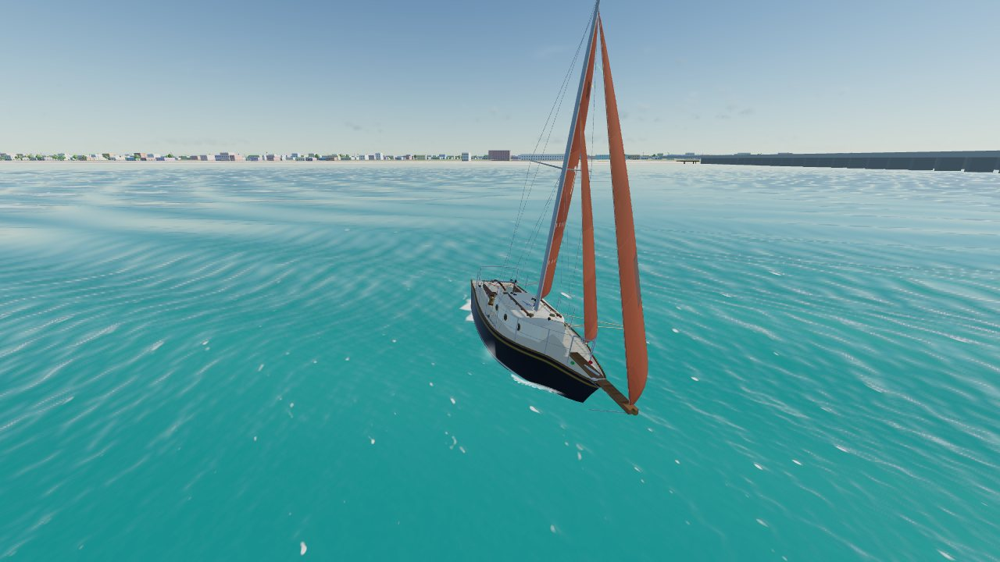

# True Wind

[](https://hclivess.github.io/truewind/)

A browser sailing simulator where the boat is not animated — it is computed. Every frame, the sails are simulated as cloth, shaped by the wind and by the strings you pull, and the air over their live shape is solved as one vortex lattice; that, the lift of the keel and rudder, the resistance of the hull, the heel, the waves and the tide are solved as forces and moments on a rigid body, 120 times a second.

**Play:** https://hclivess.github.io/truewind/

It runs in any modern browser with WebGL, with no install and no build step.

## What you can sail

| Boat | What it is |
|---|---|
| **Blackwatch 19/24** | Dave Autry's 1979 pocket bluewater cutter from Blue Water Boatworks (81 built, 1979–81). LOA 5.64 m (nearly 24 ft with the bowsprit), LWL 5.33 m, beam 2.29 m, draft 0.61 m, 1,021 kg with 363 kg of iron ballast, 19.7 m² of sail. Long keel, transom-hung rudder, teak bowsprit, self-tacking staysail, flying jib, double-reefed main. Its home port in the sim is **Progreso, Yucatán**. |
| **Sportboat 23** | A 7 m one-design keelboat with four crew, a carbon mast and an asymmetric gennaker. It planes downwind from about 13 kn of wind. |
| **Singlehander 14** | A 4.2 m una-rig Olympic-style dinghy with one sailor, a bendy unstayed mast and a daggerboard. It capsizes. |
| **Beach Cat 16** | A 5 m beach catamaran with two crew on trapeze, twin daggerboards and rudders, and a gennaker. It flies a hull from about 10 kn and pitchpoles if you bury the bows. |

Each class has its own sailcloth: tanbark Dacron on the Blackwatch, a grey tri-radial laminate with draft stripes on the sportboat, white Dacron on the dinghy. The cloth shows its seams, batten pockets, reef points and corner patches, and the sun shines through it. Telltales on the luff and on the main's leech stream while the flow is attached and lift or curl when it luffs or stalls.

## Where you can sail

These venues use real OpenStreetMap coastlines, lakes and piers, baked into `data/venues/`:

- Puerto Progreso (Yucatán)
- The Solent
- San Francisco Bay
- Lake Garda
- Sydney Harbour
- Kiel Fjord
- Narragansett Bay
- Hauraki Gulf
- Rade de Marseille
- Lake Meredith (Texas)
- Open water

You can also type any latitude and longitude on Earth. The game then downloads that coastline live from the Overpass API. **Use live wind here** fetches the current wind and gusts for the venue from Open-Meteo.

## Modes

- **Free sail.** You sail anywhere. Click the tactical map to drop a waypoint, and the instruments switch to VMC (velocity made good on course) with laylines. Time warp is available up to ×8.
- **Race.** A windward–leeward course is laid automatically in open water on the real map. It has a start sequence with signals, an OCS (over the line early) call with a dip-back requirement, a windward mark rounded to port, a leeward gate and a finish. The AI fleet sails the same physics as you do.

## Online: a shared world

Pick **Online**, then type a name and a room (or leave it on `public`). Everyone who chooses the same venue and room sails in one world. Boats can be different classes: a Blackwatch can share Progreso with dinghies.

- **No game server.** Browsers connect directly to each other over WebRTC. They find each other through public Nostr relays using [Trystero](https://github.com/dmotz/trystero), so the game still runs from static GitHub Pages.
- **Same weather for everyone.** Wind puffs, shifts and waves are deterministic functions of a seed, position and time. The first sailor in a room sets the seed, the conditions and the clock, and later arrivals adopt them.
- **Each browser owns its boat.** It simulates its own boat and streams the state 10 times a second. Other boats are re-simulated locally from their control inputs, with their own cloth sails (at the lighter level L1, see below), so their sails, heel and trim look right, and are continuously pulled toward the received position. The packet carries the reef and which side each sail is on, so a sail the two simulations tacked differently is set back on its owner's side.
- **Shared races.** Anyone can press **Start a race for the room**. Every browser then builds the same windward–leeward course from the real map and the wind, with the same gun time, and standings include everyone.

WebRTC needs a network that allows peer connections. Strict corporate firewalls can block them.

## The physics

Everything is in `js/physics.js` (boat), `js/env.js` (wind, waves, current) and `js/world.js` (map, depth, shelter).

### Rigid body
The boat moves in surge, sway, roll and yaw in SNAME body axes, with added mass and Coriolis coupling:
`(m+mₓ)(u̇ − v r·m_y/m_x) = X`, `(m+m_y)(v̇ + u r·m_x/m_y) = Y`, `I_z ṙ = N − (m_y − m_x)·u v`, `I_x ṗ = K`.
The last yaw term is the Munk moment, where m_x and m_y are the added masses. A hull moving at a drift angle carries more water sideways than lengthwise, so the flow turns it broadside. With leeway this adds weather helm. In a turn, where the bow points inside the track, it tightens the turn.
Heave and pitch respond as damped oscillators to the wave elevation along the hull. The response includes bow-down trim from sail drive, squat, crew fore-aft trim, and the bow lifting as the boat starts to plane.

### Sails: cloth under a vortex lattice
Every boat's sails, yours, the AI fleet's and the online boats', are simulated cloth, loaded by a vortex-lattice model of the air over their live shape (`js/sail/`).

- **Cloth** (`cloth.js`). Each sail is a membrane cut to its sailmaker's moulded shape, with separate stiffness along the warp, along the fill and on the bias (cross-cut Dacron on the Blackwatch and the dinghy, tri-radial laminate on the sportboat and the cat, light nylon for the gennakers). It carries no compression: it wrinkles instead. It is integrated with projective dynamics (implicit, four substeps per step), which is stable for stiff sailcloth and gives the static stretch exactly (`node test/cloth.mjs`). The air a sail carries with it is part of its mass.
- **Rig** (`rigsim.js`). The luff is held on the mast or on the stay, and the stay sags to leeward with load and less backstay. The boom is a body on its gooseneck held by ropes: the mainsheet to the traveller car, the vang and a topping lift. The outhaul moves the clew along the boom, the cunningham tensions the luff, and mast bend moves the luff forward against the luff round cut into the sail. Headsails are held by two sheets to the jib cars, and the car's position decides whether the sheet pulls along the foot or down the leech. Twist, boom lift, a hooked or open leech, a backed jib and the clew crossing in a tack all come out of that. A reef makes the sail smaller.
- **Air** (`vlm.js`). All the sails form one vortex lattice with a frozen wake, so the headsail's downwash on the main, the slot and a backed jib pushing on the main come from the flow itself. The sail's own motion is part of the boundary condition, which gives the aerodynamic damping. The apparent wind at every panel comes from the wind gradient (a neutral log boundary layer, `U(h) = U₁₀ ln(h/z₀)/ln(10/z₀)`, z₀ from Charnock roughness) minus the boat's surge, sway, yaw, roll and heave, so twisted flow is in it; in the rain-cooled outflow under a squall the air is up to about 3% denser.
- **The boat under the sails.** The water is a mirror under the rig. Close-hauled, the hull, deck and crew close the gap under a sail whose foot lies over the boat, so that foot sheds no vortex: such a sail takes its mirror in the plane of its own foot. A headsail seals only if its foot sweeps the deck (not the Blackwatch's high-cut yankee out on the bowsprit), and as a sail is eased out past the rail its mirror returns to the water. This is what gives a rig its effective span: upright in even wind the sportboat's rig works as a wing of 12.5 m span over its mirror, against ORC's empirical effective height of about 14 m close-hauled; with open gaps the lattice gave 10.8 m, and every rig lost 10–20% of its upwind drive.
- **Viscous sections.** Each spanwise strip's lift is pulled onto a 2-D section polar at its effective angle of attack (decambering: Mukherjee & Gopalarathnam 2006): thin-airfoil lift on the live camber (the zero-lift angle is measured from the cloth), saturating at the maximum lift its depth allows. The section's drag is ORC's parasitic drag at close-hauled angles (0.03) plus its lift-dependent viscous part, 0.014–0.016 × C_L² for mains and jibs and 0.026 × C_L² for spinnakers (ORC VPP documentation 2023); the mast, rigging, hull and crew are the boat's windage. Strips past the stall, or with the wind over the leech, take the polar's separated-flow force. A separated strip casts a wake of slow air as wide as the strip seen from the wind, which fills in downstream: that is how the main blankets the headsails on a run. A strip that carries almost no lift gets a travelling pressure wave, so a luffing sail flogs. The lattice's lift acts on the cloth normal to it, and its leading-edge suction acts on the mast or stay.
- **Coupling.** The rig hands the hull what it actually carries: the air's load on every particle, minus the inertia of its motion relative to the hull. A boom snatched up short by its sheet therefore hands its momentum to the hull. Each strip's force acts where it is, so heel, weather helm and yaw come out of the geometry.
- **The crew** (`autoTrim`, used by the AI, the trim assist and the velocity prediction) trims each cloth sail by its telltales: the angle each strip really meets, from the lattice. It eases while a sail meets the wind at more than the angle it wants and hauls in while less, puts the jib car where the luff breaks evenly top and bottom, sets the main's twist upwind with the vang (about 11° at the top batten on the boats with a traveller, more when overpowered), lets the outhaul off and puts the vang on off the wind, and when overpowered eases in proportion to the heel. The sheet's sign is the side the sail's camber is on, so a traveller pulled to windward (the boom past the centreline) is not read as a backed sail.
- **Levels and cost.** Each boat runs at a level: L0, the full lattice and cloth (the player), L1, a coarser lattice and cloth (the AI fleet and online boats; its polars are within about 4% of L0's), or L2, the strip model below. On load a short benchmark picks where the player starts; the fleet starts at L1 if the player can run L0 or L1. A governor keeps the physics under 6 ms a frame: over budget it drops the boat farthest from the camera a level (the fleet first, the player last), and well under budget for a while it lifts them back. Time warp beyond ×2 uses the strip model. Costs on one server core: `node test/bench.mjs` and `node test/bench-fleet.mjs`.

### The strip model (fallback: `?sails=strip`, or level L2)
The lighter model splits each sail into three horizontal strips. Each strip's camber depth, draft position and twist are set directly by the controls (mainsheet, traveler, vang, cunningham, outhaul, backstay, jib car, halyard, tack line, reefs, and stretch with load), its coefficients come from fitted functions of that shape (maximum lift and stall angle grow with depth, induced drag is `C_L²/(π·AR_e)`, flat-plate behaviour past the stall), the headsail's downwash on the main is a fixed correction, and a fixed factor blankets the headsails on a deep run. It is about ten times cheaper than the cloth and is what weak devices and time warp use. Add `?sails=strip` to the address to sail with it throughout (`?sails=vlm` puts the vortex lattice under the strip model's rig-set shapes).

### Rig dynamics
- **Booms** (main, and the Blackwatch's self-tacking staysail) are rotating bodies. They are driven by aerodynamic torque and gravity at heel, and stopped by the sheet. Gybes, crash-gybes, backwinding and the death roll all emerge from that, including the angular momentum the boom hands to the hull when it slams.
- **Loose headsails** have two sheets. The working sheet holds the clew until it is let fly (`F`). The lazy sheet, ground in on the windward winch (`J`), hauls the clew across and backs the jib (to heave to or get out of irons). When the clew crosses, the sheets swap roles. Automatic trim releases and re-tails the sheets in a tack. Every winch works: two-speed cranking (clockwise fast, anticlockwise powerful), and the handle moves to the winch you use. On the Blackwatch and the sportboat, a cabin-top winch takes any control led aft through the clutches. Each handle turn hauls a fixed length of line (about 19 cm in the fast gear, a third of that in the slow gear), and heavy loads stall the fast gear. Every line sits in a cam cleat, clutch or self-tailer. Released, a loaded line runs out by itself until you cleat it again.
- **Sheets** ease fast but trim slower under load. The rate depends on sheet tension against crew and winch power. The panel shows mainsheet, jib sheet and backstay loads in newtons, mast bend and headstay sag in millimetres.
- **The rudder** slews at a rate limited by its hydrodynamic load. A tiller you let go of trails toward the blade's zero-load angle, so a boat with weather helm rounds up.

### Foils and hull
- **Keel, daggerboard and rudder** are finite wings, with the Helmbold lift slope `2π/(2/AR + √(1+(2/AR)²))`, stall, post-stall flat-plate behaviour and induced drag. Each sees water-relative velocity, which includes wave orbital motion, yaw and roll rates, and the keel's downwash on the rudder. The rudder ventilates at extreme heel, which is how broaches happen. Raising the daggerboard cuts both area and aspect ratio.
- **Hull resistance** has three parts:
  - ITTC-57 friction.
  - Residuary (wave-making) resistance tabulated against Froude number for each hull. This gives the Blackwatch's hard wall at 5.6 kn and lets the dinghy and sportboat plane. The catamaran's slender hulls do not plane. Their table comes from towing-tank data for catamarans of the same slenderness (the Southampton series), and it stays at about 5% of the boat's weight past the hump. Flying a hull puts the whole weight on one hull and raises that figure by up to 30%.
  - Extra terms for heel drag, fore-aft trim, added resistance in waves, cross-flow drag, yaw damping and the heeled hull's asymmetry.
- **Stability** combines a GZ curve (weight and form terms) with crew weight at its real height. With the crew hiked and the boat heeled past about 50°, the crew adds to the capsizing moment instead of fighting it.

### Environment
- **Wind.** Puffs and lulls are noise in space and time: they are carried downwind at about the mean wind speed, stretched along it, and grow and die as they go, so the pattern never repeats. Puffs come down from aloft carrying a veered wind (backed south of the equator) and fan out as they land, lifting you on one edge and heading you on the other. Oscillating and spatial shifts are layered on top. Land upwind shelters the wind, which recovers over roughly a kilometre of open water.
- **Weather.** Steady, changing or squally. The gradient wind drifts in speed and direction over tens of minutes, and a sea breeze or land breeze builds and fades with the real sun at the venue. In squally weather a cumulonimbus cell comes through about every 11 minutes. Each one is born, towers up to an anvil, and dies over about 70 minutes while it tracks across with the wind aloft. Ahead of it the wind lulls into the updraft; under it the gust front hits, veered on one flank and backed on the other, with heavy rain that closes the visibility. Behind it the air is light and fitful. Mature cells throw lightning. Everything is a function of the seed and the clock, so everyone in a shared room gets the same squall at the same moment.
- **Waves.** A fetch-limited JONSWAP sea is grown from wind speed and the real upwind fetch to the coastline, and discretised into Gerstner components, with optional ocean swell. The GPU shader and the physics use the same components. Waves push the hull (Froude–Krylov surge force, so you surf), roll it, yaw it, and shrink in the lee and in shallow water.
- **Tide.** A current field is applied over ground. The instruments work like real ones: TWS and TWA are computed from the masthead unit and boat speed through the water.
- **Depth.** Estimated bathymetry shelves out from the real shoreline with shoals. Your keel or board can run aground.

### Velocity prediction
The velocity prediction (the live polar, the POLAR % instrument, the laylines and the AI's upwind and downwind angles) is the boat's steady speed at 15 true-wind angles, with the automatic crew, yaw locked, in flat water and steady wind, keeping the best of several trim targets (and with or without the gennaker). For the cloth sails that takes minutes, so `node tools/bake-sail-surrogate.mjs` runs it offline, at the game's 120 Hz step with the full cloth model, for 4 to 25 kn of wind, and writes `data/sails/<class>.json`; the game interpolates those tables for the wind of the moment. The strip model's polar (`?sails=strip`) is still computed in the browser (`solvePolar()`).

Polars from `node test/vpp.mjs` in 12 kn of true wind (boat speed in knots, `g` = under gennaker or spinnaker); in brackets the strip model's (`SAILS=strip node test/vpp.mjs`):

| Boat | Upwind (TWA, speed, VMG) | 90° | 120° | 150° | Best downwind VMG |
|---|---|---|---|---|---|
| Blackwatch | 44°, 4.18, 3.01 (40°, 4.1, 3.1) | 4.94 (5.2) | 4.73 (5.0) | 4.04 (4.4) | 3.70 at 165° (3.9) |
| Sportboat | 40°, 6.00, 4.60 (40°, 6.1, 4.7) | 8.12 g (8.6 g) | 8.57 g (10.2 g) | 6.59 g (7.0 g) | 5.80 at 165° (6.2) |
| Dinghy | 40°, 4.92, 3.77 (36°, 4.4, 3.6) | 6.47 (6.2) | 5.79 (5.7) | 4.75 (4.7) | 4.34 at 180° (4.4) |
| Beach cat | 48°, 8.04, 5.38 (55°, 9.6, 5.5) | 13.64 g (13.3 g) | 11.33 g (15.2 g) | 6.76 g (7.6 g) | 6.42 at 135° (7.7) |

The sportboat is J/70-sized, and the J/70's ORC certificate (2024) gives, in 12 kn: beat VMG 4.52 kn at 37.6°, 6.88 kn at 90°, 7.72 kn at 120°, 6.47 kn at 150° and a run VMG of 5.60 kn. The cloth sails are within 4% of it upwind, at 150° and downwind, and faster reaching (8.1 and 8.6 kn, +18% and +11%); the strip model's reaching speeds are 25–32% above the certificate. Downwind, the cloth rigs' drive agrees with ORC's sail coefficients to within about 10%, where the strip model's is 20–25% higher: most of the difference in the downwind columns. The cat's reaching and downwind numbers under spinnaker have no certificate to check against.

In 20 kn the sportboat reaches at 13.5 kn and does 14.7 kn at 120° under gennaker, and the cat reaches at 18.8 kn. The Blackwatch sails upwind with 6° of leeway (a long keel) and cannot pass its 5.6 kn hull speed.

Helm balance (`node test/helm.mjs`) is the rudder angle that holds a steady course. With the Munk moment included, the keelboats are neutral upwind in 12 kn and carry 1–2° of weather helm reaching.

## What is approximated

These are the honest limits:

- **Sail sections are semi-empirical.** The lattice is potential flow; each section's viscous lift and drag come from a fitted 2-D polar (depth, draft and ORC's drag), not from CFD. Whether a strip has stalled is decided on its angle to the free stream, without the other sails' downwash, and a stalled strip keeps its leading-edge suction; that is weakest for a main behind two headsails. Flogging is forced by a pressure wave rather than solved.
- **The boat under the sails is a mirror.** The hull and deck sealing the feet is modelled as a mirror plane per sail, not as a body; the boom's gap above the deck counts as closed while it lies over the boat, as ORC's effective heights imply.
- **Heavy air.** In 25 kn the automatic crew capsizes the cat at 105° and 135° (the baked polar shows zero there); in 20 kn the cat and the sportboat still roll a few degrees back and forth on a broad reach.
- **Light air.** In 6–8 kn the Blackwatch's upwind VMG is 9–11% below the strip model's (its heavy cruising Dacron weighs a fifth to a third of the wind's pressure on it there; whether that is the whole cause is not established).
- **Depth is estimated.** It comes from distance to shore and the venue's typical depth, because OSM carries no bathymetry.
- **The hull model is simplified.** Heave and pitch follow the waves as a response model, not a full 6-DOF seakeeping solution. Slamming and green water are not modelled.
- **AI tactics are simple.** Crews use laylines, header tacks, starts and traffic avoidance. They do not apply the racing rules (right of way), and neither is a protest system.

## Controls

| Key | Action |
|---|---|
| `A` `D` / `←` `→` | Steer. The helm stays where you leave it; `Space` centres it. |
| `W` `S` | Mainsheet trim / ease |
| `↑` `↓` | Jib or gennaker sheet. Hold `Shift` for the staysail. |
| `F` | Let the jib sheet fly |
| `Z` `X` | Traveler |
| `C` `V` | Vang |
| `N` `M` | Backstay |
| `Q` `E` | Crew in / hike out |
| `J` / `Shift`+`J` | Haul / ease the lazy jib sheet to back the jib (una-rig: push the boom out) |
| `G` | Gennaker hoist / douse |
| `R` | Reef, or right a capsized dinghy |
| `Y` | Daggerboard |
| `T` `H` | Auto-trim / auto-hike |
| `1`–`7` | Cameras: chase, helm, bow, masthead, overhead, orbit, on deck |
| `L` `K` `I` | Laylines, force vectors, physics readout |
| `-` `=` | Time warp |
| `P` `Esc` | Pause, menu |
| `O` | Sound on / off |
| `?` | Help |

With the mouse, drag to look around and use the wheel to zoom; zooming all the way in puts you at the helm. Click the tactical map to drop a waypoint. On deck you can grab the lines themselves: pull ropes, slide cars along their tracks, wind winch handles round (clockwise is the fast gear), push the tiller, and click a cleat to release or cleat its line.

Every line is also in the rig panel as press-and-hold buttons, with a LOCK/FREE toggle for its cleat. Menu options include tiller steering (push the tiller and the bow goes the other way).

On a phone or tablet, drag to look around, pinch to zoom, and tap a rope, winch or cleat on deck to grab it. The touch pad holds the helm (◀ ▶ and Centre), the mainsheet and jib sheet, and one more line of the class (traveler, staysail, vang, crew weight, tack line, backstay or daggerboard): tap its name to pick the next. Auto trim and the gennaker hoist sit under it. The **Rig** button opens every line.

## Graphics

On a weak GPU, add `?q=low` to the URL. It lowers the render resolution, turns off shadows and uses a coarser sea mesh; the physics is unchanged.

## Running locally

```
python3 -m http.server 8000
# open http://localhost:8000
```

Development tools:

- `node test/vpp.mjs [class]` prints polars.
- `node test/race.mjs solent sportboat 6 25` runs a headless AI race on a real map.
- `node test/vlm.mjs`, `node test/cloth.mjs` and `node test/sailshape.mjs [class]` check the vortex lattice, the sailcloth and the cloth sails' shapes. `node test/bench.mjs [class]` times one physics step per sail model, `node test/bench-fleet.mjs [class] [n]` a race fleet.
- `node tools/bake-sail-surrogate.mjs [class…]` re-bakes the cloth sails' polars into `data/sails/` (about 15 minutes for all four classes on 10 cores). Tests run with the cloth sails; `SAILS=strip` runs them with the strip model.
- `node tools/fetch-venues.mjs [id…]` re-bakes venues from OpenStreetMap.

## Credits and licences

- Map data © [OpenStreetMap](https://www.openstreetmap.org/copyright) contributors, available under the ODbL. It is fetched through the Overpass API.
- Live weather is from [Open-Meteo](https://open-meteo.com).
- 3D rendering uses [three.js](https://threejs.org) (MIT). Peer-to-peer networking uses [Trystero](https://github.com/dmotz/trystero) (MIT).
- Blackwatch 19/24 specifications come from [sailboatdata.com](https://sailboatdata.com/sailboat/blackwatch-1924/), [sailboat.guide](https://sailboat.guide/blackwatch-19) and owner listings.
- The code is under the MIT licence (see `LICENSE`).
