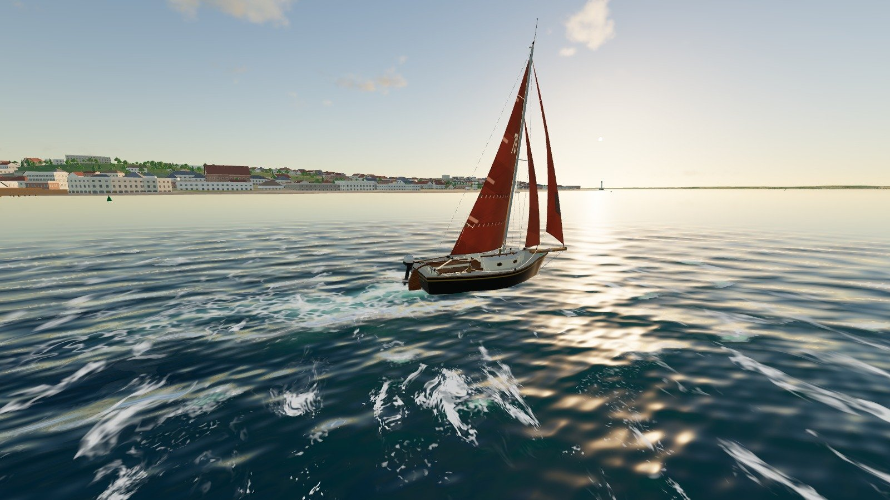

# True Wind

[](https://hclivess.github.io/truewind/)

A browser sailing simulator where the boat is not animated — it is computed. Every frame, the sails are simulated as cloth, shaped by the wind and by the strings you pull, and the air over their live shape is solved as one vortex lattice; that, the lift of the keel and rudder, the resistance of the hull, the heel, the waves and the tide are solved as forces and moments on a rigid body, 120 times a second.

**Play:** https://hclivess.github.io/truewind/

It runs in any modern browser with WebGL, with no install and no build step.

## What you can sail

| Boat | What it is |
|---|---|
| **Blackwatch 19/24** | Dave Autry's 1979 pocket bluewater cutter from Blue Water Boatworks (81 built, 1979–81). LOA 5.64 m (nearly 24 ft with the bowsprit), LWL 5.33 m, beam 2.29 m, draft 0.61 m, 1,021 kg with 363 kg of iron ballast, 19.7 m² of sail. Long keel, transom-hung rudder, teak bowsprit, self-tacking staysail, flying jib, double-reefed main. Its home port in the sim is **Progreso, Yucatán**. |
| **Sportboat 23** | A 7 m one-design keelboat with four crew, a carbon mast and an asymmetric gennaker. It planes downwind from about 13 kn of wind. |
| **Singlehander 14** | A 4.2 m una-rig Olympic-style dinghy with one sailor, a bendy unstayed mast and a daggerboard. It capsizes. |
| **Beach Cat 16** | A 5 m beach catamaran with two crew on trapeze, twin daggerboards and rudders, and a gennaker. It flies a hull from about 10 kn and pitchpoles if you bury the bows. |

Each class has its own sailcloth: tanbark Dacron on the Blackwatch, a grey tri-radial laminate with draft stripes on the sportboat, white Dacron on the dinghy. The cloth shows its seams, batten pockets, reef points and corner patches, and the sun shines through it. Telltales on the luff and on the main's leech stream while the flow is attached and lift or curl when it luffs or stalls.

## Where you can sail

These venues use real OpenStreetMap coastlines, lakes and piers, baked into `data/venues/`:

- Puerto Progreso (Yucatán)
- The Solent
- San Francisco Bay
- Lake Garda
- Sydney Harbour
- Kiel Fjord
- Narragansett Bay
- Hauraki Gulf
- Rade de Marseille
- Lake Meredith (Texas)
- The Southern Ocean (Drake Passage: a westerly gale over a big westerly swell)
- Open water

You can also type any latitude and longitude on Earth. The game then downloads that coastline live from the Overpass API. **Use live wind here** fetches the current wind and gusts for the venue from Open-Meteo.

## Modes

- **Free sail.** You sail anywhere. Click the tactical map to drop a waypoint, and the instruments switch to VMC (velocity made good on course) with laylines. Time warp is available up to ×8.
- **Race.** A windward–leeward course is laid automatically in open water on the real map. It has a start sequence with signals, an OCS (over the line early) call with a dip-back requirement, a windward mark rounded to port, a leeward gate and a finish. The AI fleet sails the same physics as you do.

## Navigation

Every venue carries its real seamarks from OpenStreetMap / OpenSeaMap (`data/venues/<id>.seamarks.json`; a custom location fetches them live with its coastline): lighthouses and harbour lights, lateral, cardinal, isolated-danger, safe-water and special marks, light floats, wrecks and rocks. Major lights up to about 28 km outside the sailing area are included, so their loom shows from the water (the Needles from the Solent, Point Judith from Newport).

- **On the water.** Buoys have their IALA shape (can, conical, pillar, spar, spherical), colours and topmark and ride the waves; beacons stand on posts, piles or towers; lighthouses are towers of the tagged height and colours. Where the tags leave colours out, the IALA region decides (A: red to port; B, the Americas, Japan, Korea and the Philippines: green to port). Buoys and beacons are solid.
- **Lights.** From dusk every light shows its real characteristic, colour and period — Fl(2) G 5s, Q(6)+LFl 15s, Oc(3) 15s, Iso, Mo(A), alternating and sector lights (coloured by your bearing from the light) — as a glowing point that fades with range, haze and the curve of the Earth. Lights on rotating optics sweep a beam. Lighthouses the map gives no light for show an assumed Fl W 10s (marked `?` on the chart).
- **Chart** (`Tab`, or **Chart** on the toolbar): north up, with the coastline, depth bands from the depth estimate, the seamarks in simplified INT-1 symbols with their light characteristics and sectors, your track and 6-minute COG/SOG vector, the race course, a lat/lon grid and a scale. Drag to pan, wheel or pinch to zoom, click or tap to set a waypoint (on a seamark: steer for it); hover a mark for its details. **Labels** turns the names off.
- **Nav readout** (under the tactical map): COG, SOG, depth, position, and to the waypoint (in a race, the next mark) BRG, DTW, XTE, VMC and ETA. The steering compass above the instruments shows the heading, COG (orange), the bearing to the waypoint (blue) and the wind.

`node test/seamarks.mjs` checks the light timings, sectors, labels, IALA regions and every venue's seamarks; `node tools/fetch-venues.mjs --seamarks [id…]` re-bakes them.

## Online: a shared world

Pick **Online**, then type a name and a room (or leave it on `public`). Everyone who chooses the same venue and room sails in one world. Boats can be different classes: a Blackwatch can share Progreso with dinghies.

- **No game server.** Browsers connect directly to each other over WebRTC. They find each other through public Nostr relays using [Trystero](https://github.com/dmotz/trystero), so the game still runs from static GitHub Pages.
- **Same weather for everyone.** Wind puffs, shifts and waves are deterministic functions of a seed, position and time. The first sailor in a room sets the seed, the conditions and the clock, and later arrivals adopt them.
- **Each browser owns its boat.** It simulates its own boat and streams the state 10 times a second. Other boats are re-simulated locally from their control inputs, with their own cloth sails (at the lighter level L1, see below), so their sails, heel and trim look right, and are continuously pulled toward the received position. The packet carries the reef and which side each sail is on, so a sail the two simulations tacked differently is set back on its owner's side.
- **Shared races.** Anyone can press **Start a race for the room**. Every browser then builds the same windward–leeward course from the real map and the wind, with the same gun time, and standings include everyone.

WebRTC needs a network that allows peer connections. Strict corporate firewalls can block them.

## The physics

Everything is in `js/physics.js` (boat), `js/env.js` (wind, waves, current) and `js/world.js` (map, depth, shelter).

### Rigid body
The boat moves in surge, sway, roll and yaw in SNAME body axes, with added mass and Coriolis coupling:
`(m+mₓ)(u̇ − v r·m_y/m_x) = X`, `(m+m_y)(v̇ + u r·m_x/m_y) = Y`, `I_z ṙ = N − (m_y − m_x)·u v`, `I_x ṗ = K`.
The last yaw term is the Munk moment, where m_x and m_y are the added masses. A hull moving at a drift angle carries more water sideways than lengthwise, so the flow turns it broadside. With leeway this adds weather helm. In a turn, where the bow points inside the track, it tightens the turn.
Heave and pitch respond as damped oscillators to the wave elevation along the hull. The response includes bow-down trim from sail drive, squat, crew fore-aft trim, and the bow lifting as the boat starts to plane.

### Sails: cloth under a vortex lattice
Every boat's sails, yours, the AI fleet's and the online boats', are simulated cloth, loaded by a vortex-lattice model of the air over their live shape (`js/sail/`).

- **Cloth** (`cloth.js`). Each sail is a membrane cut to its sailmaker's moulded shape, with separate stiffness along the warp, along the fill and on the bias (cross-cut Dacron on the Blackwatch and the dinghy, tri-radial laminate on the sportboat and the cat, light nylon for the gennakers). It carries no compression: it wrinkles instead. It is integrated with projective dynamics (implicit, four substeps per step), which is stable for stiff sailcloth and gives the static stretch exactly (`node test/cloth.mjs`). The air a sail carries with it is part of its mass.
- **Rig** (`rigsim.js`). The luff is held on the mast or on the stay, and the stay sags to leeward with load and less backstay. The boom is a body on its gooseneck held by ropes: the mainsheet to the traveller car, the vang and a topping lift. The outhaul moves the clew along the boom, the cunningham tensions the luff, and mast bend moves the luff forward against the luff round cut into the sail. Headsails are held by two sheets to the jib cars, and the car's position decides whether the sheet pulls along the foot or down the leech. Twist, boom lift, a hooked or open leech, a backed jib and the clew crossing in a tack all come out of that. A reef makes the sail smaller.
- **Air** (`vlm.js`). All the sails form one vortex lattice with a frozen wake, so the headsail's downwash on the main, the slot and a backed jib pushing on the main come from the flow itself. The sail's own motion is part of the boundary condition, which gives the aerodynamic damping. The apparent wind at every panel comes from the wind gradient (a neutral log boundary layer, `U(h) = U₁₀ ln(h/z₀)/ln(10/z₀)`, z₀ from Charnock roughness) minus the boat's surge, sway, yaw, roll and heave, so twisted flow is in it; in the rain-cooled outflow under a squall the air is up to about 3% denser.
- **The boat under the sails.** The water is a mirror under the rig. Close-hauled, the hull, deck and crew close the gap under a sail whose foot lies over the boat, so that foot sheds no vortex: such a sail takes its mirror in the plane of its own foot. A headsail seals only if its foot sweeps the deck (not the Blackwatch's high-cut yankee out on the bowsprit), and as a sail is eased out past the rail its mirror returns to the water. This is what gives a rig its effective span: upright in even wind the sportboat's rig works as a wing of 12.5 m span over its mirror, against ORC's empirical effective height of about 14 m close-hauled; with open gaps the lattice gave 10.8 m, and every rig lost 10–20% of its upwind drive.
- **Viscous sections.** Each spanwise strip's lift is pulled onto a 2-D section polar at its effective angle of attack (decambering: Mukherjee & Gopalarathnam 2006): thin-airfoil lift on the live camber (the zero-lift angle is measured from the cloth), saturating at the maximum lift its depth allows. The section's drag is ORC's parasitic drag at close-hauled angles (0.03) plus its lift-dependent viscous part, 0.014–0.016 × C_L² for mains and jibs and 0.026 × C_L² for spinnakers (ORC VPP documentation 2023); the mast, rigging, hull and crew are the boat's windage. Strips past the stall, or with the wind over the leech, take the polar's separated-flow force. A separated strip casts a wake of slow air as wide as the strip seen from the wind, which fills in downstream: that is how the main blankets the headsails on a run. A strip that carries almost no lift gets a travelling pressure wave, so a luffing sail flogs. The lattice's lift acts on the cloth normal to it, and its leading-edge suction acts on the mast or stay.
- **Coupling.** The rig hands the hull what it actually carries: the air's load on every particle, minus the inertia of its motion relative to the hull. A boom snatched up short by its sheet therefore hands its momentum to the hull. Each strip's force acts where it is, so heel, weather helm and yaw come out of the geometry.
- **The crew** (`autoTrim`, used by the AI, the trim assist and the velocity prediction) trims each cloth sail by its telltales: the angle each strip really meets, from the lattice. It eases while a sail meets the wind at more than the angle it wants and hauls in while less, puts the jib car where the luff breaks evenly top and bottom, sets the main's twist upwind with the vang (about 11° at the top batten on the boats with a traveller, more when overpowered), lets the outhaul off and puts the vang on off the wind, and when overpowered eases in proportion to the heel. The sheet's sign is the side the sail's camber is on, so a traveller pulled to windward (the boom past the centreline) is not read as a backed sail.
- **Levels and cost.** Each boat runs at a level: L0, the full lattice and cloth (the player), L1, a coarser lattice and cloth (the AI fleet and online boats; its polars are within about 4% of L0's), or L2, the strip model below. On load a short benchmark picks where the player starts; the fleet starts at L1 if the player can run L0 or L1. A governor keeps the physics under 6 ms a frame: over budget it drops the boat farthest from the camera a level (the fleet first, the player last), and well under budget for a while it lifts them back. Time warp beyond ×2 uses the strip model. Costs on one server core: `node test/bench.mjs` and `node test/bench-fleet.mjs`.

### The strip model (fallback: `?sails=strip`, or level L2)
The lighter model splits each sail into three horizontal strips. Each strip's camber depth, draft position and twist are set directly by the controls (mainsheet, traveler, vang, cunningham, outhaul, backstay, jib car, halyard, tack line, reefs, and stretch with load), its coefficients come from fitted functions of that shape (maximum lift and stall angle grow with depth, induced drag is `C_L²/(π·AR_e)`, flat-plate behaviour past the stall), the headsail's downwash on the main is a fixed correction, and a fixed factor blankets the headsails on a deep run. It is about ten times cheaper than the cloth and is what weak devices and time warp use. Add `?sails=strip` to the address to sail with it throughout (`?sails=vlm` puts the vortex lattice under the strip model's rig-set shapes).

### Rig dynamics
- **Booms** (main, and the Blackwatch's self-tacking staysail) are rotating bodies. They are driven by aerodynamic torque and gravity at heel, and stopped by the sheet. Gybes, crash-gybes, backwinding and the death roll all emerge from that, including the angular momentum the boom hands to the hull when it slams.
- **Loose headsails** have two sheets. The working sheet holds the clew until it is let fly (`F`). The lazy sheet, ground in on the windward winch (`J`), hauls the clew across and backs the jib (to heave to or get out of irons). When the clew crosses, the sheets swap roles. Automatic trim releases and re-tails the sheets in a tack. Every winch works: two-speed cranking (clockwise fast, anticlockwise powerful), and the handle moves to the winch you use. On the Blackwatch and the sportboat, a cabin-top winch takes any control led aft through the clutches. Each handle turn hauls a fixed length of line (about 19 cm in the fast gear, a third of that in the slow gear), and heavy loads stall the fast gear. Every line is held by the hardware the real boat uses (`js/linehandlers.js`, specs in each class's `lines`): the Laser's mainsheet in the hand through its ratchet block and its vang, cunningham and outhaul in deck cam cleats; the J/70's 5:1 mainsheet on a ratchet with a cam on its swivel base, jib sheets on winches with cam cleats, gennaker sheets hand-held through 2x-grip ratchets, controls through a cabin-top clutch bank; the Hobie 16's 6:1 Ratchamatic with its cam on the traveller car, the traveller cleated in a cam on the car, jib sheets in swivel cams; the Blackwatch's bronze winches with horn cleats for the jib sheets and (at the mast foot) the jib halyard, a V-jammer for the staysail sheet, a push-button traveller car and a clam cleat on the boom. Each has its own slip load (a Harken 150 cam holds 1330 N, a clutch 4400 N, a horn cleat anything), its own time to make fast and cast off (a cam a fifth of a second, figure-eights on a horn three seconds), its own release (a cam or clutch dumps the line, a winch or horn lets it surge round, a ratchet + cam leaves it in the hand) and one-way hauling (a cam, clam, clutch, ratchet or self-tailer lets the line come in while it is closed; a horn cleat, jammer or push-button car has to be cast off first). A ratchet block holds all but a tenth (a twentieth for a 2x grip) of the load above its engaging load, so the hand holds what it could not. Overloaded, a handler slips and the sheet runs out until the load falls (a Hobie's spinnaker sheet in 28 kn runs through the trimmer's hand). Every line has its own colour and braid as boats are rigged: mainsheet navy with a white fleck, jib sheets red, gennaker sheets red to port and green to starboard, halyards white with a coloured tracer (main blue, jib red, gennaker green), vang black, cunningham yellow, outhaul green, backstay orange, traveller blue, staysail teal, tack line purple, reef lines by reef; the Blackwatch has classic cream rope with the colour as a tracer.
- **Sheets** ease fast but trim slower under load. The rate depends on sheet tension against crew and winch power. The panel shows mainsheet, jib sheet and backstay loads in newtons, mast bend and headstay sag in millimetres.
- **The rudder** slews at a rate limited by its hydrodynamic load. A tiller you let go of trails toward the blade's zero-load angle, so a boat with weather helm rounds up.

### Foils and hull
- **Keel, daggerboard and rudder** are finite wings, with the Helmbold lift slope `2π/(2/AR + √(1+(2/AR)²))`, stall, post-stall flat-plate behaviour and induced drag. Each sees water-relative velocity, which includes wave orbital motion, yaw and roll rates, and the keel's downwash on the rudder. The rudder ventilates at extreme heel, which is how broaches happen. Raising the daggerboard cuts both area and aspect ratio.
- **Hull resistance** has three parts:
  - ITTC-57 friction.
  - Residuary (wave-making) resistance tabulated against Froude number for each hull. This gives the Blackwatch's hard wall at 5.6 kn and lets the dinghy and sportboat plane. The catamaran's slender hulls do not plane. Their table comes from towing-tank data for catamarans of the same slenderness (the Southampton series), and it stays at about 5% of the boat's weight past the hump. Flying a hull puts the whole weight on one hull and raises that figure by up to 30%.
  - Extra terms for heel drag, fore-aft trim, added resistance in waves, cross-flow drag, yaw damping and the heeled hull's asymmetry.
- **Stability** combines a GZ curve (weight and form terms) with crew weight at its real height. With the crew hiked and the boat heeled past about 50°, the crew adds to the capsizing moment instead of fighting it.

### Engines
The keelboats carry an auxiliary; the dinghy and the beach cat do not. The Blackwatch has a long-shaft 4 hp outboard on a transom bracket beside its rudder (what owners fit: the boats were built without an inboard). The sportboat carries the 3.5 hp outboard its class rules require, on the bracket for free sailing and stowed below for racing. The propeller follows the Wageningen B-series open-water polynomials (thrust and torque against advance ratio), extended smoothly to all four quadrants: going astern, crash stops, and a stopped prop's drag (a folding prop folds; a fixed one windmills or, left in gear, is locked; an outboard is slid up its transom bracket clear of the water). It has a wake fraction and thrust deduction, and it drives an engine with a torque curve, friction, a governor and a gearbox that shifts through neutral. Prop walk pushes the stern to port going astern with a right-handed prop. A rudder behind an inboard's prop sits in its slipstream, so a burst ahead kicks the stern round at no speed. The engine's weight sits where the engine is. Motoring after the preparatory signal retires you from a race. `test/engine.mjs` checks bollard pull (about 13 kg/hp), speed under power (4.9 kn and 5.6 kn), crash stops, prop walk, the propwash turn, and the drag of a stopped prop under sail.

### Environment
- **Wind.** Puffs and lulls are noise in space and time: they are carried downwind at about the mean wind speed, stretched along it, and grow and die as they go, so the pattern never repeats. Puffs come down from aloft carrying a veered wind (backed south of the equator) and fan out as they land, lifting you on one edge and heading you on the other. Oscillating and spatial shifts are layered on top. Land upwind shelters the wind, which recovers over roughly a kilometre of open water.
- **Weather.** Steady, changing or squally. The gradient wind drifts in speed and direction over tens of minutes, and a sea breeze or land breeze builds and fades with the real sun at the venue. Where the wind that matters comes from beyond the map, the venue adds it as regional forcing, driven by the same sun with the region's own slower memory and blowing along the terrain: at Lake Garda the Pelèr blows down the lake at 10-20 kn from the small hours until late morning and the Ora comes up it from about noon, 15-25 kn through a summer afternoon, gone by evening; in San Francisco the Golden Gate westerly (the Pacific against the Central Valley's heat) is light in the morning, 15-25 kn WSW through the afternoon and still blowing at dusk, and weak in winter. There the wind slider sets the gradient under the thermal. Changing the time of day in the menu moves the breeze and the sea with the sky. In squally weather a cumulonimbus cell comes through about every 11 minutes. Each one is born, towers up to an anvil, and dies over about 70 minutes while it tracks across with the wind aloft. Ahead of it the wind lulls into the updraft; under it the gust front hits, veered on one flank and backed on the other, with heavy rain that closes the visibility. Behind it the air is light and fitful. Mature cells throw lightning; a flash lights the storm's base from inside and the shelf cloud beneath it through its own tiers. You hear the rain at your position, from a hiss on the water and a patter on deck to a drumming roar in the core, and thunder from the strike's bearing: a sharp crack close by, a long low rumble from far off, arriving at the speed of sound. Everything is a function of the seed and the clock, so everyone in a shared room gets the same squall at the same moment.
- **Waves.** A fetch-limited JONSWAP sea is grown from wind speed and the real upwind fetch to the coastline (fully developed Pierson–Moskowitz in open water: Hs 9 m in 40 kn, 20 m in 60 kn), and discretised into Gerstner components with a second-order (Tayfun) crest, with an ocean swell of up to 16 m and 20 s crossing the wind sea at 40°. An open-ocean gale brings its own swell under the local sea. The GPU shader and the physics use the same components. Waves shoal and break over shallow water (H > 0.78 depth).
- **Rogue waves.** Now and then the sea's own components come into phase at one place and time: a focused wave group (a constrained NewWave) that builds over tens of seconds, stands up to a crest of 1.1–1.45 Hs and a height of about 2.2 Hs (the Draupner wave: 25.6 m in Hs 12 m), and disperses again. They come at the rate Forristall's second-order crest statistics give, raised a little for steep, narrow-banded seas (their excess kurtosis), from the seed and the clock, so a shared room has the same ones; in a 60 kn storm one passes within 1.5 km about once an hour. `?rogue` in the address sends one to your boat. `node test/big-seas.mjs` checks the sea state against Pierson–Moskowitz and JONSWAP, the crest and height distributions against Rayleigh and Forristall, and the drawn surface against the physics'.
- **Breaking crests.** The steepest crests (local steepness past the onset of spilling, or the depth limit) lean forward and break: a roller of white water over the crest, white water cascading down the front face, spray thrown ahead, and a sheet of foam left behind.
- **What the water does to the hull.** The hull, keel and rudder move through the water's orbital velocity, decaying with depth, plus the surface layer's Stokes drift. Froude–Krylov and diffraction (added-mass) loads come section by section from the water's pressure gradient and acceleration (strip theory), so big waves heave, surge and roll the boat by the inertia of their water. A following sea's face drives the boat past its hull speed; on a crest the water at the stern runs with the boat and the rudder loses its grip, which is how a broach starts. A breaking crest's jet (at about its phase speed) strikes the exposed topsides and deck: beam-on, a breaker about 30% of the boat's length high knocks it well over and one of about 55% lays it flat or rolls it past 90°, the order of the model tests after the 1979 Fastnet (`node test/knockdown.mjs`). Added resistance in waves comes only from the waves near the boat's own length.
- **Hull waves** (`hullwaves.js`). Every boat makes its own waves. Each hull presses on the water with the depth of its immersed sections at the current heel, pitch and heave, so a boat at rest leaves the sea flat. The sea answers as linear deep water, integrated exactly in Fourier space on a 256² grid over 128 m that follows you (after Tessendorf's eWave). The result is the Kelvin wake: transverse waves 2πU²/g long and divergent waves out to the 19.5° cusp, the bow and stern waves, the hollow behind a transom, and rings when a bow slams. `test/hullwaves.mjs` checks the wavelength and the cusp angle at Froude numbers 0.2–0.4. The wake is drawn on the sea, and it changes the short waves on top of it: they are steeper on its crests, and the turbulent strip behind the hull smooths them for a minute or more. The bow wave and the steepest crests break into foam, and the transom's wash leaves a white strip that spreads as it ages. A planing hull throws a rooster tail. With `?q=low` the game draws a precomputed steady Kelvin pattern, scaled by the speed and laid along the track, instead of running the simulation.
- **Tide.** A current field is applied over ground. The instruments work like real ones: TWS and TWA are computed from the masthead unit and boat speed through the water.
- **Depth.** Estimated bathymetry shelves out from the real shoreline with shoals. Your keel or board can run aground.

### Damage, anchoring, mooring, man overboard, the crew's strength

Nothing here is random: things break when their loads say so. **Damage: realistic / off** is in the rig panel's Boat section, which also shows the most loaded rig part (% of its breaking load, its peak and its wear), the sails, the hull, water in the bilge, the anchor, the lines and two crew meters. Code: `js/damage.js`, `anchor.js`, `mooring.js`, `mob.js`, `fatigue.js` (pure logic), `gear.js` (the game wiring), `gear-render.js` (the drawing).

- **Standing rigging.** A static rig analysis every step: the moment the rig carries into the hull (the sails' heeling moment, the rig's weight and roll inertia, and the sea on a rig that is in it) is taken by the windward shrouds over the chainplate half-beam, split between cap shroud and lowers, plus the dock pretension (Nordic Boat Standard / Skene); the forestay carries the headsail's lateral load over its sag (T = w L² / 8δ) or the backstay's reaction. Against 1x19 AISI 316 minimum breaking loads (3 mm 7.4 kN, 4 mm 12.8, 5 mm 20.1, 6 mm 28.9): Blackwatch 5 mm caps, lowers and forestay, 4 mm backstay (safety factor 3.8 on the cap at RM30); the J/70-size sportboat 4 mm (1.9); the beach cat 3/16" (2.6). The Laser's unstayed mast bends: moment at the partners and at the joint of its sections against the tubes' yield moments (σ_y π r² t: ~1.5 kN m bottom, ~0.8 top). Above 75% of its breaking load a part accumulates overload damage, every load cycle adds Miner fatigue (S-N: N = 10⁶ (0.3/r)⁵), damage lowers its breaking load, and it fails outright at 100%: the same loads always break the same rig. Steady sailing cannot do it (the caps part at 2–5 × the largest righting moment); a rig driven into the sea can: rolled past the horizontal at more than about 1–1.3 rad/s the mast breaks (bending under the water's drag, capped by what stopping the roll in ~0.12 s takes), while a knockdown that only puts the sail and boom in the water leaves it standing. A crash gybe's shock reaches the rig through the sheet and the leech. Where the structural rig model (`js/rig-structure.js`, `boat.rigLoads`) runs, its wire tensions replace the estimate. Dismasted, the mast breaks where it would (above the spreaders when a cap shroud or stay lets go, at the deck when a lower or chainplate does, a Laser at its partners or joint; a beach cat's mast falls whole), the top hangs over the side on its wires with the sail plastered on the sea and drags (its drag and weight go through the physics), and you can cut it away.
- **Sails** tear when the cloth's stress exceeds its strength: the cloth solver's membrane tension (95th percentile of its triangles, warp and fill) times 3 at the corner patches, against the cloth's strip strength (7–8 oz Dacron ~45 kN/m, dinghy Dacron ~30, laminate ~52, 0.75 oz nylon ~6) derated for seams and a season's UV. A flogging sail wears by Miner's rule at dt / T, T = T₀ (145 Pa / q)^2.2 (a Dacron main flogging in 30 kn of apparent wind lasts ~20 minutes, in 50 kn ~2). A tear grows while the sail is loaded (reef or douse it to save it), costs the sail its area and pressure, is cut into the sail, and past three quarters the sail is blown out. The sail model's boom-bending hook (`boomOverload(boat, ratio)`) breaks a boom the same way.
- **Hull.** A collision loses E = ½ μ v² (1 − e²), μ = m₁m₂/(m₁+m₂), e = 0.3; a stem into topsides puts 70% into the topsides. Over the hull's crack energy it costs damage points (drag); over its penetration energy (~2.6 kJ Blackwatch, 1.5 kJ J/70, 0.7 kJ Laser) it holes her. An inflatable race mark is harmless, a steel buoy (1.5 t) or a pier is not. A grounding delivers ½ m v² at the strike, the share into the structure set by the bottom (rock 0.8, gravel 0.4, sand 0.12, mud 0.03): the bottom is rock within 40 m of a charted rock, wreck or obstruction, sand near an OSM beach, rock under a steep shore, else the venue's bottom. It works the keel bolts (a leak), then takes the keel off (no ballast, no lateral plane: over she goes unless the crew holds her up), splits a long keel's garboard, breaks a daggerboard; a rudder that strikes bends its stock (limited, biased helm, a weaker blade). Pounding on the bottom in a sea repeats the strikes.
- **Flooding.** Each hole lets in Q = Cd A √(2 g h), Cd 0.6, h the depth of the hole under the sea (heel, heave, pitch, waves) less the water standing inside, which rises where the hull's own sections hold its volume; the companionway downfloods when its sill goes under. Pumps: the Blackwatch's Whale Gusher 10 at 64 L/min, a J/70's 45 (slower as the pumper tires), a Laser's self-bailer while she moves. The water's weight and free surface make her heavy, low and tender; past her reserve buoyancy she sinks (a 5 cm hole 0.4 m down lets in ~200 L/min: a Blackwatch goes down in about an hour), unless foam or sealed tanks keep her awash. In a race, being dismasted, sinking, or losing the keel or rudder retires you.
- **Anchoring** (`U`, keelboats): the Blackwatch carries a 7 kg Delta on 10 m of 6 mm chain and 35 m of 12 mm nylon, the J/70 a Fortress FX-7 (1.8 kg) on 3 m of chain and 30 m of line. The chain is a catenary (a = H/w, x = a asinh(s/a)) partly lying on the bottom, the nylon a straight elastic line on top of it; for the horizontal distance and the height of the bow roller (depth + tide + freeboard + the sea at the bow, so waves snub it) the tension is solved every step and pulls the bow. Holding = k × anchor weight by type and bottom (Delta 25× in sand, 12× in mud, 3× on rock; claw 15/8/5; fluke 50/40/2), reduced by the angle the rode lifts the shank and until the anchor has set; past it the anchor drags, and resets after a few metres of good bottom (never on rock). The crew pays out 5:1, drops the sails and hauls in at hand-hauling speed (slower when tired). She swings to wind and tide on it. The anchor light (all-round white at the masthead) shows at night (`boat.lights.anchor`).
- **Mooring** (`9` alongside a pier or pontoon from the OSM data, or at a mooring buoy): bow and stern lines and two springs to the dock edge, each a spring-damper that only pulls (the rope's stiffness softened by knots and cleats), and fenders with a contact force (~30 kN/m); casting off takes them in.
- **Man overboard.** A knockdown or capsize (heel past 55° with a roll rate over ~0.8 rad/s) or a crash gybe with the crew on the rail can throw exposed crew over: the chance for each grows with the roll rate squared and with the exposure (trapeze > hiking > sitting in a cruiser's cockpit), drawn from a hash of the race seed (deterministic, the same online). No crew figure is ever drawn: the person in the water is a danbuoy with a flashing strobe and a horseshoe ring, drifting with the current and 1.1% of the wind (US Coast Guard leeway for a person in the water). The crew presses the plotter's MOB button at once (`0` marks it by hand): the chart marks the spot and steers back to it. Stop within about 2 m at under 1.5 kn to recover them; their weight is off the rail meanwhile. A single-hander in the water swims for the boat (0.5 m/s), which sails on unmanned with the helm free until she rounds up or you catch her; a Laser's ordinary capsize is not a man overboard.
- **The crew's strength.** Hiking is an isometric hold: ~45% of maximal voluntary contraction for a Laser sailor straight-legged, ~30% over a keelboat's rail, 13–14% on a trapeze or a cruiser's rail. Rohmert's curve gives its endurance (a full Laser hike ~80 s, a keelboat hike ~2.5 min; under ~15% for hours); the reserve drains and recovers (half in ~50 s) and caps how far out the crew, automatic or yours, can hang. Grinding, tailing, pumping and hauling the anchor follow the critical-power model (CP ~150 W sustained, W′ ~18 kJ above it, recovered with Skiba's time constant): spent, the crew pulls about half as hard, so sheets come in slower. The panel shows both as meters.

For a new class the damage model reads `C.rigSpec`, `C.hullSpec` and `C.anchor` if given (the fields of `RIG`, `HULL` and `ANCHOR` in the modules), and otherwise sizes the wire, the hull's energies, the ballast and the ground tackle from the class's displacement, righting moment and rig.

### Velocity prediction
The velocity prediction (the live polar, the POLAR % instrument, the laylines and the AI's upwind and downwind angles) is the boat's steady speed at 15 true-wind angles, with the automatic crew, yaw locked, in flat water and steady wind, keeping the best of several trim targets (and with or without the gennaker). For the cloth sails that takes minutes, so `node tools/bake-sail-surrogate.mjs` runs it offline, at the game's 120 Hz step with the full cloth model, for 4 to 25 kn of wind, and writes `data/sails/<class>.json`; the game interpolates those tables for the wind of the moment. The strip model's polar (`?sails=strip`) is still computed in the browser (`solvePolar()`).

Polars from `node test/vpp.mjs` in 12 kn of true wind (boat speed in knots, `g` = under gennaker or spinnaker); in brackets the strip model's (`SAILS=strip node test/vpp.mjs`):

| Boat | Upwind (TWA, speed, VMG) | 90° | 120° | 150° | Best downwind VMG |
|---|---|---|---|---|---|
| Blackwatch | 44°, 4.18, 3.01 (40°, 4.1, 3.1) | 4.94 (5.2) | 4.73 (5.0) | 4.04 (4.4) | 3.70 at 165° (3.9) |
| Sportboat | 40°, 6.00, 4.60 (40°, 6.1, 4.7) | 8.12 g (8.6 g) | 8.57 g (10.2 g) | 6.59 g (7.0 g) | 5.80 at 165° (6.2) |
| Dinghy | 40°, 4.92, 3.77 (36°, 4.4, 3.6) | 6.47 (6.2) | 5.79 (5.7) | 4.75 (4.7) | 4.34 at 180° (4.4) |
| Beach cat | 48°, 8.04, 5.38 (55°, 9.6, 5.5) | 13.64 g (13.3 g) | 11.33 g (15.2 g) | 6.76 g (7.6 g) | 6.42 at 135° (7.7) |

The sportboat is J/70-sized, and the J/70's ORC certificate (2024) gives, in 12 kn: beat VMG 4.52 kn at 37.6°, 6.88 kn at 90°, 7.72 kn at 120°, 6.47 kn at 150° and a run VMG of 5.60 kn. The cloth sails are within 4% of it upwind, at 150° and downwind, and faster reaching (8.1 and 8.6 kn, +18% and +11%); the strip model's reaching speeds are 25–32% above the certificate. Downwind, the cloth rigs' drive agrees with ORC's sail coefficients to within about 10%, where the strip model's is 20–25% higher: most of the difference in the downwind columns. The cat's reaching and downwind numbers under spinnaker have no certificate to check against.

In 20 kn the sportboat reaches at 13.5 kn and does 14.7 kn at 120° under gennaker, and the cat reaches at 18.8 kn. The Blackwatch sails upwind with 6° of leeway (a long keel) and cannot pass its 5.6 kn hull speed.

Helm balance (`node test/helm.mjs`) is the rudder angle that holds a steady course. With the Munk moment included, the keelboats are neutral upwind in 12 kn and carry 1–2° of weather helm reaching.

## What is approximated

These are the honest limits:

- **Sail sections are semi-empirical.** The lattice is potential flow; each section's viscous lift and drag come from a fitted 2-D polar (depth, draft and ORC's drag), not from CFD. Whether a strip has stalled is decided on its angle to the free stream, without the other sails' downwash, and a stalled strip keeps its leading-edge suction; that is weakest for a main behind two headsails. Flogging is forced by a pressure wave rather than solved.
- **The boat under the sails is a mirror.** The hull and deck sealing the feet is modelled as a mirror plane per sail, not as a body; the boom's gap above the deck counts as closed while it lies over the boat, as ORC's effective heights imply.
- **Heavy air.** In 25 kn the automatic crew capsizes the cat at 105° and 135° (the baked polar shows zero there); in 20 kn the cat and the sportboat still roll a few degrees back and forth on a broad reach.
- **Light air.** In 6–8 kn the Blackwatch's upwind VMG is 9–11% below the strip model's (its heavy cruising Dacron weighs a fifth to a third of the wind's pressure on it there; whether that is the whole cause is not established).
- **Depth is estimated.** It comes from distance to shore and the venue's typical depth, because OSM carries no bathymetry.
- **Damage is a load-and-energy model, not a structural solver.** Rig loads come from a static analysis (or from the structural rig model where it runs) and wire breaking loads from makers' tables; the mast sections, the hulls' crack and penetration energies, the keel attachments and the seabed by area are estimates of the right order (marked `~` in the specs), not measurements of these boats. The water inside is levelled with the boat upright.
- **The hull model is simplified.** Heave and pitch follow the waves as a response model, not a full 6-DOF seakeeping solution. The wave loads are strip theory on seven samples of the sea along the hull, with one decay wavenumber per quantity (the velocity, acceleration or drift spectrum's mean) instead of each wave's own; radiation damping is a fixed fraction of critical. Slamming under the bow is not modelled; green water only as a push on a buried foredeck.
- **Breaking waves are a jet, not a flow.** The breaking crest is a forward lean of the Gerstner surface and a jet force on the hull: its speed (0.9 of the crest's phase speed), thickness (0.3 of the local wave height) and slamming coefficient (C_s = 2.5, an average over the slam; real peak pressures are several times it and last milliseconds) are set so the beam-on knockdown thresholds come out at the model tests' order. The energy behind it is real (E = ρgH²/8, a 4 m breaker carries 20 kJ per m² and 120 kW per metre of crest at its group speed), but no water is conserved or thrown: the boat's roll past 90° is limited by the rig lying in still water, where a real breaker carries the water around the mast with it.
- **Rogue groups are windowed.** A group is added to the sea's components inside a compact window a few wavelengths and periods across that moves with it; the sea outside it is untouched, so a group's energy is not taken from elsewhere. The twenty components alone make crests up to about 0.9–1 Hs and hardly any higher; the tail of the distribution is the groups'. The water draws the two groups nearest the boat; a third one close by is felt by the boat but not drawn.
- **The sea is linear-plus-second-order.** No modulational instability, no wave–wave energy transfer; a sea changes by growing and decaying toward the wind's spectrum.
- **AI tactics are simple.** Crews use laylines, header tacks, starts and traffic avoidance. They do not apply the racing rules (right of way), and neither is a protest system.

## Controls

| Key | Action |
|---|---|
| `A` `D` / `←` `→` | Steer. The helm stays where you leave it; `Space` centres it. |
| `W` `S` | Mainsheet trim / ease |
| `↑` `↓` | Jib or gennaker sheet. Hold `Shift` for the staysail. |
| `F` | Let the jib sheet fly |
| `Z` `X` | Traveler |
| `C` `V` | Vang |
| `N` `M` | Backstay |
| `Q` `E` | Crew in / hike out |
| `J` / `Shift`+`J` | Haul / ease the lazy jib sheet to back the jib (una-rig: push the boom out) |
| `G` | Gennaker hoist / douse |
| `R` | Reef, or right a capsized dinghy |
| `Y` | Daggerboard |
| `T` `H` | Auto-trim / auto-hike |
| `B` | Start / stop the engine (boats that have one) |
| `PgUp` `PgDn` / `]` `[` | Throttle ahead / astern, through a neutral detent |
| `1`–`7` | Cameras: chase, helm, bow, masthead, overhead, orbit, on deck |
| `L` `K` `I` | Laylines, force vectors, physics readout |
| `Tab` | Chart (click or tap it for a waypoint) |
| `U` | Anchor: drop / weigh (keelboats) |
| `9` | Lines: make fast alongside a pier or pontoon, or to a mooring buoy / cast off |
| `0` | MOB: mark the spot on the plotter and steer back to it |
| `-` `=` | Time warp |
| `P` `Esc` | Pause, menu |
| `O` | Sound on / off |
| `?` | Help |

With the mouse, drag to look around and use the wheel to zoom; zooming all the way in puts you at the helm. Click the tactical map to drop a waypoint. On deck you can grab the lines themselves: pull ropes, slide cars along their tracks, wind winch handles round (clockwise is the fast gear), push the tiller, and click a cleat to release or cleat its line.

Every line is also in the rig panel as press-and-hold buttons, with its rope's colour and a button for what holds it: the handler's icon and its state (LOCK, SET or MAKE while it is made fast, OFF while it is cast off, FREE / EASE / HAND, SLIP), click to make fast or cast off. Easing a line (or hauling one off a horn cleat) takes it off its handler first, and it is made fast again when you let go. Menu options include tiller steering (push the tiller and the bow goes the other way).

On a phone or tablet, drag to look around, pinch to zoom, and tap a rope, winch or cleat on deck to grab it. The touch pad holds the helm (◀ ▶ and Centre), the mainsheet and jib sheet, and one more line of the class (traveler, staysail, vang, crew weight, tack line, backstay or daggerboard): tap its name to pick the next. Auto trim and the gennaker hoist sit under it. On a boat with an engine, a throttle lever and a Start button sit beside it. The **Rig** button opens every line.

## Graphics

On a weak GPU, add `?q=low` to the URL. It lowers the render resolution, turns off shadows and uses a coarser sea mesh; the physics is unchanged.

## Running locally

```
python3 -m http.server 8000
# open http://localhost:8000
```

Development tools:

- `node test/vpp.mjs [class]` prints polars.
- `node test/race.mjs solent sportboat 6 25` runs a headless AI race on a real map.
- `node test/vlm.mjs`, `node test/cloth.mjs` and `node test/sailshape.mjs [class]` check the vortex lattice, the sailcloth and the cloth sails' shapes. `node test/bench.mjs [class]` times one physics step per sail model, `node test/bench-fleet.mjs [class] [n]` a race fleet.
- `node tools/bake-sail-surrogate.mjs [class…]` re-bakes the cloth sails' polars into `data/sails/` (about 15 minutes for all four classes on 10 cores). Tests run with the cloth sails; `SAILS=strip` runs them with the strip model.
- `node tools/fetch-venues.mjs [id…]` re-bakes venues from OpenStreetMap (`--land` for buildings and roads, `--seamarks` for lights, buoys and beacons).
- `node test/seamarks.mjs` checks light characters, sectors, IALA regions and the venues' seamarks.
- `node test/damage.mjs`, `node test/anchor.mjs`, `node test/mob.mjs` and `node test/fatigue.mjs` check rig loads against the righting-moment rule, the dismasting threshold, collision energy, leak rate and sinking time, rudder and keel damage and sail tearing; the rode's catenary, holding and swinging; the drift and recovery of a person in the water; hiking endurance and the crew's work reserve.

## Credits and licences

- Map data © [OpenStreetMap](https://www.openstreetmap.org/copyright) contributors, available under the ODbL. It is fetched through the Overpass API.
- Live weather is from [Open-Meteo](https://open-meteo.com).
- 3D rendering uses [three.js](https://threejs.org) (MIT). Peer-to-peer networking uses [Trystero](https://github.com/dmotz/trystero) (MIT).
- Blackwatch 19/24 specifications come from [sailboatdata.com](https://sailboatdata.com/sailboat/blackwatch-1924/), [sailboat.guide](https://sailboat.guide/blackwatch-19) and owner listings.
- The code is under the MIT licence (see `LICENSE`).
